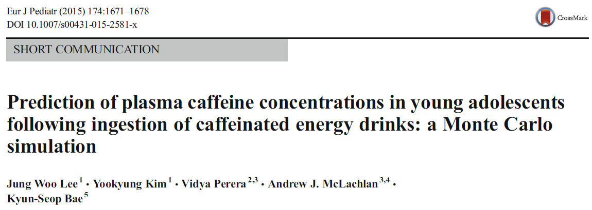

```{r setup, include=FALSE}
knitr::opts_chunk$set(echo = TRUE)

```

# Introduction {.tabset}

## Project rationale


Basis-Publikation *Lee et al* [1]<br>



## Working hypotheses

Deutschen Text ggf. in UTF-8 speichern (Umlaute etc.)<br>


# Methods{.tabset}

## Data Analysis

Non-compartmental pharmacokinetic analysis [2].

## Packages

```{r, echo=FALSE, results='hide', message=F, warning=F}
# load packages
  if(!require(tidyverse)) {install.packages("tidyverse"); library(tidyverse, quietly = TRUE)}
  if(!require(dplyr)) {install.packages("dplyr"); library(dplyr, quietly = TRUE)}
  if(!require(gt)) {install.packages("gt"); library(gt, quietly = TRUE)}
  if(!require(magrittr)) {install.packages("magrittr"); library(magrittr, quietly = TRUE)}
  if(!require(qwraps2)) {install.packages("qwraps2"); library(qwraps2, quietly = TRUE)}
  if(!require(xtable)) {install.packages("xtable"); library(xtable, quietly = TRUE)}

```

* Key packages:
  + NonCompart 
```{r, echo=T}
  packageVersion("NonCompart")
```
  + ncar
```{r, echo=T}
  packageVersion("ncar")
```

* alternativ: sessionInfo()
```{r, echo=T, eval=F}
  sessionInfo()
```

```{r, echo=FALSE, results='hide', message=F, warning=F}
  
# load packages and data

knitr::opts_knit$set(root.dir = rprojroot::find_rstudio_root_file())  
```

```{r, echo=FALSE, results='hide', message=F, warning=F}

  load("results/nca_analysis.RData")
  data <- read.table("data/data.csv", header=T, sep=";")
  covs <- data %>% distinct(ID, .keep_all = TRUE) %>% select(-Time,-Y)
  load("results/nca_analysis.RData")
  res$ID <- 1:nrow(res)
  results <- res %>% left_join(covs, by="ID")
  
  raw_results <- results %>% dplyr::select(ID, CMAX, Dose, TMAX, AUCLST, CLFO, Weight) %>%
    gt() %>%
    tab_header(
      title = "NCA",
      subtitle = glue::glue("Selected PK summary measures")
    ) %>% fmt_number(columns = vars(CMAX), decimals = 2) %>% fmt_number(columns = vars(TMAX), decimals = 1) %>% fmt_number(columns = vars(AUCLST), decimals = 0) %>% fmt_number(columns = vars(CLFO), decimals = 2)
  
  # define the markup language we are working in.
  # options(qwraps2_markup = "latex") is also supported.
  options(qwraps2_markup = "markdown")

  our_summary1 <-
    list("Cmax" = list("min" = ~ min(CMAX),
              "max" = ~ max(CMAX),
              "mean (sd)" = ~ qwraps2::mean_sd(CMAX)),
         "AUC"= list("min" = ~ min(AUCLST),
              "max" = ~ max(AUCLST),
              "mean (sd)" = ~ qwraps2::mean_sd(AUCLST)),
         "Early or late Tmax" =
         list("early" = ~ qwraps2::n_perc0(TMAX <= median(TMAX), digits=1),
              "late"  = ~ qwraps2::n_perc0(TMAX > median(TMAX), digits=1)))
  
  # oder
  # %>%
  #  qsummary(.,
  #           numeric_summaries = list("Minimum" = "~ min(%s)",
  #                                    "Maximum" = "~ max(%s)"),
  #           n_perc_args = list(digits = 1, show_symbol = TRUE, show_denom = "always"))

  whole <- summary_table(results, our_summary1)
  
  by_dose <- results %>% mutate(Dosis = as.factor(Dose)) %>% group_by(Dosis) %>% summary_table(., our_summary1)
  
  both <- cbind(whole, by_dose)


mpvals <-
  list(lm(log(CMAX) ~ as.factor(Dose),  data = results),
       lm(log(AUCLST) ~ as.factor(Dose),   data = results)) %>%
  lapply(aov) %>%
  lapply(summary) %>%
  lapply(function(x) x[[1]][["Pr(>F)"]][1]) %>%
  lapply(frmtp) %>%
  do.call(c, .)

# Fisher test
  fpval <- frmtp(fisher.test(table(I(results$TMAX>median(results$TMAX)), as.factor(results$Dose)))$p.value)

```


# Results {.tabset }

## Descriptives {.tabset .tabset-dropdown}

### Data head
```{r data, echo=FALSE, results='asis'}

knitr::kable(xtable(head(data, 10), digits=c(0, 1,3,0,0,0)), #length equal ncol(x) + 1 
             format="pandoc", caption="Data", row.names = FALSE) 

```

### Summaries

```{r, echo=FALSE}
  drucken <- TRUE
  source("src/descriptives.R")

```


## Noncompart {.tabset .tabset-dropdown}

### Raw NCA results table

```{r, echo=FALSE, results='asis'}
  #print(NA_pattern)
  raw_results
```

### Grouped NCA results table

```{r, echo=FALSE, results='asis'}
  #print(NA_pattern)
  both <- cbind(both, "P-value" = "")
  both[grepl("mean \\(sd\\)", rownames(both)), "P-value"] <- mpvals
  both[grepl("early", rownames(both)), "P-value"] <- fpval
  print(both)
  #print(both,
#      rtitle = "Summary Statistics",
#      cnames = c("Total", "Dose: 50 mg", "Dose: 100 mg", "Dose: 200 mg", "P value"))
```

## Plots

```{r spaghetti1, echo=FALSE, fig.height=7.5, fig.width=18, dpi=300, out.width="1440px",height="1720px", warning=FALSE, message=F}


```

### P1


### P2


### P3


# Discussion

Shiny-Link, falls Shiny-App online ist. 

# References

```{r generateBibliography, results="asis", echo=FALSE}
require("knitcitations", quietly=T)
cleanbib()
options("citation_format" = "pandoc")
read.bibtex(file = "paper/bibliography.bib")
``` 

<small>
Footnotes
</small>